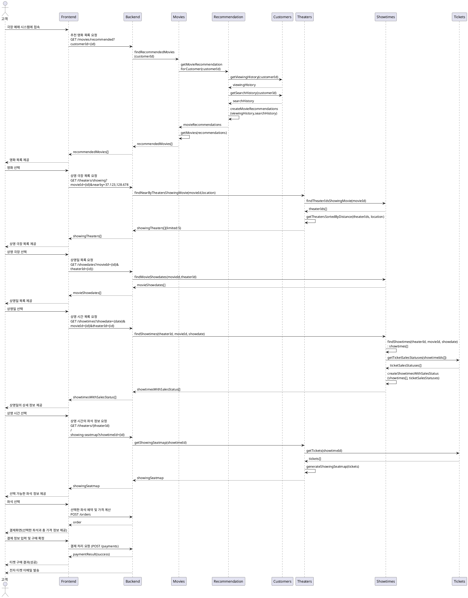
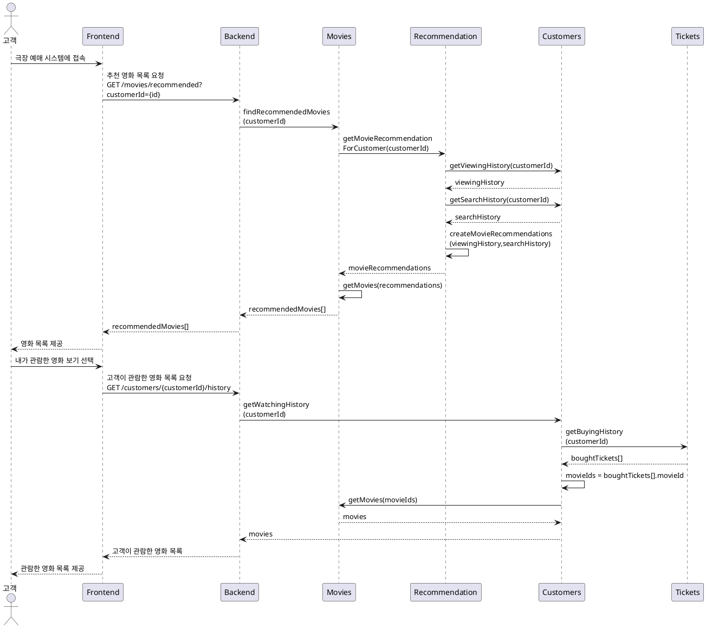
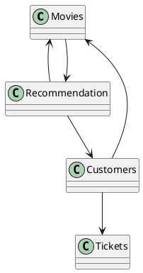
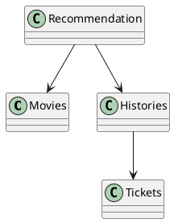
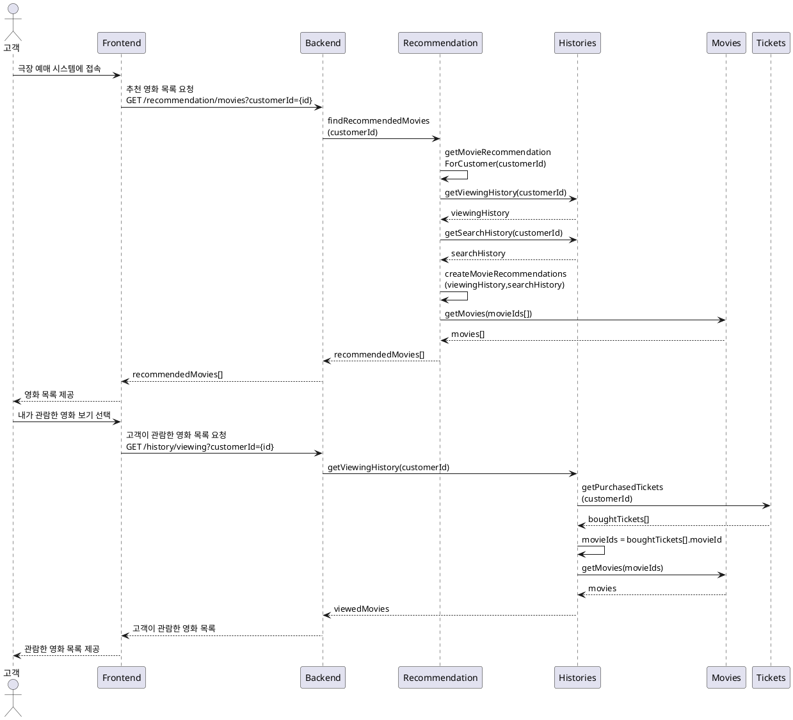
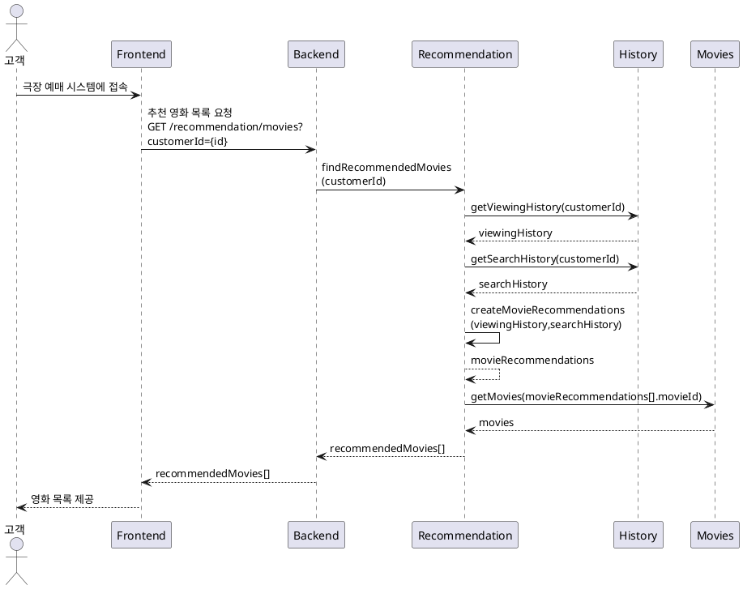
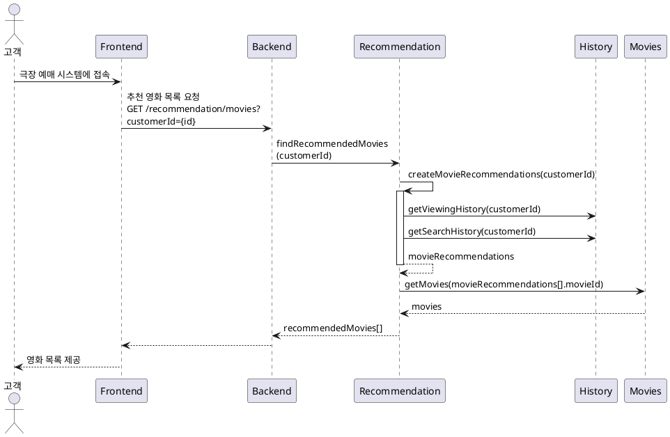
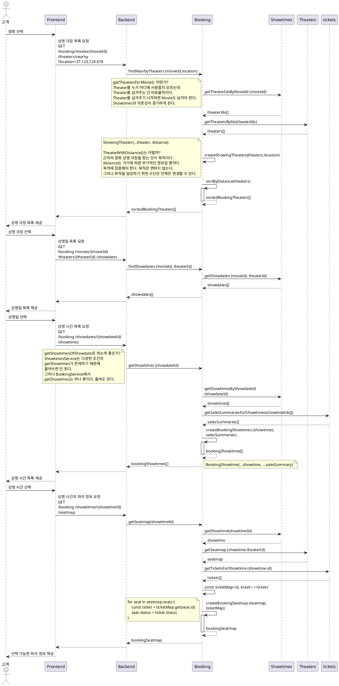

# 티켓 구매 프로세스

### 유스케이스 명: 티켓 구매 (Buy Tickets)

**선행 조건**:

-   고객이 시스템에 로그인되어 있어야 한다.
-   원하는 영화와 극장의 상영 시간 및 좌석이 사용 가능해야 한다.

**기본 흐름**:

1. 고객은 극장 예매 시스템에 접속한다.
1. 시스템은 주간 인기, 월간 인기, 최신 순서로 정렬된 영화 목록을 제공한다.
1. 고객은 영화 목록에서 원하는 영화를 선택한다.
1. 시스템은 영화를 상영하는 극장 목록을 제공한다.
    - 사용자의 현재 위치를 기반으로 반경 5km의 가까운 극장을 추천
    - 특정 지역을 선택하여 해당 지역의 극장 목록을 제공
    - 없으면 가장 가까운 극장 5개
1. 고객은 상영하는 극장을 선택한다.
1. 시스템은 선택된 극장에서 영화 상영일 목록을 제공한다.
1. 고객은 원하는 상영일을 선택한다.
1. 시스템은 선택한 상영일의 상세 정보를 제공한다.
    - 상영 시간 별 남은 좌석수를 포함해야 한다.
1. 고객은 원하는 상영 시간을 선택한다.
1. 시스템은 해당 상영의 선택이 가능한 좌석을 보여준다.
    - 좌석은 로얄석, 커플석 등 등급이 있다.
    - 좌석은 층,블록,열,좌석번호로 지정된다.
1. 고객은 하나 이상의 좌석을 선택한다.
    - 선택한 좌석은 10분간 선점된다.
1. 시스템은 선택한 좌석과 총 가격을 요약하여 보여준다.
1. 고객은 결제 정보를 입력하고 구매를 확정한다.
1. 시스템은 결제를 처리하고, 티켓 구매 성공 메시지와 함께 전자 티켓을 제공한다.

**대안 흐름**:

-   A1. 원하는 상영 시간이나 좌석이 사용 불가능한 경우:
    -   시스템은 사용 불가능한 메시지를 표시하고, 다른 상영 시간이나 좌석을 선택하도록 유도한다.
-   A2. 결제가 실패한 경우:
    -   시스템은 결제 실패 메시지를 표시하고, 결제 정보를 재입력하거나 다른 결제 방법을 선택하도록 유도한다.

**후행 조건**:

-   고객은 구매한 티켓에 대한 전자 티켓을 이메일로 받는다.
-   시스템은 구매된 티켓의 좌석을 사용 불가능으로 업데이트한다.

**특별 요구 사항**:

-   시스템은 결제 처리를 위해 외부 결제 게이트웨이(PaymentGateway)와 통신해야 한다.
-   시스템은 고객이 선택한 좌석이 동시에 다른 고객에게 판매되지 않도록 동시성 관리를 해야 한다.
-   모든 통신은 보안 프로토콜을 통해 이루어져야 한다.

**비즈니스 규칙**:

-   고객은 한 번에 최대 10장의 티켓을 구매할 수 있다.
-   상영 30분 전까지만 온라인으로 티켓을 구매할 수 있다.





고객에게 추천하는 영화목록에 필요한 서비스의 생성

```ts
const customers = new CustomersService()
const recommendation = new RecommendationService(customersService)
const movies = new MoviesService(recommendationService)
```

고객이 관람한 영화목록에 필요한 서비스의 생성

```ts
const tickets = new TicketsService()
const movies = new MoviesService()
const customers = new CustomersService(tickets, movies)
```

순환 종속성 문제가 있음

```ts
const recommendation = new RecommendationService(customers)
const movies = new MoviesService(recommendation)
const tickets = new TicketsService()
const customers = new CustomersService(tickets, movies)
```



해결#1 - 순환 종속하는 서비스를 하나로 만든다.

```ts
const tickets = new TicketsService()
const recommendationmoviescustomers = new MoviesCustomersRecommendationService(recommendation)
```

해결#2 - 객체의 종속성을 생성 시점이 아닌, 이후에 설정하는 방식으로 주입한다.

```ts
const recommendation = new RecommendationService()
const movies = new MoviesService(recommendation)
const tickets = new TicketsService()
const customers = new CustomersService(tickets, movies)

// 억지스러운 코드
recommendation.customers = customers

// 이런 부작용이 생긴다
if (this.customers) {
    console.log('')
}
```

해결#3 - 서비스를 분리한다.

RecommendationService와 HistoryService를 중심으로 디자인 한다.
Movies나 Theaters는 사용자가 직접 사용하기 보다는 다른 서비스들이 의존하게 되는 Foundation Service다.
사용자에게 직접 노출되는 서비스는 Application Service다.





HistoryService에 RecommendationService의 기능을 추가하고 싶은 욕구에 시달릴지도 모른다.
그런데 잘 생각해 봐야한다. 두 개를 합치려는 것이 의미적으로 맞기 때문인지? 단순히 크기가 작기 때문인지?
단 한 줄이라도 의미가 다르면 분리해야 한다. 그것이 파일이든 함수든 클래스든 상관없다.
크기는 프로젝트가 진행 되면서 얼마든지 커질 수 있다.
백엔드는 여러 명의 개발자가 장기간에 걸쳐서 개발하는 것이 보통이다.
크기가 작으니까 합친다는 '예외'를 두는 것은 그런 환경에서 좋지 못하다.
최적화/효율에 대한 본능적인 욕심을 버려라.

## 개선된 영화 예매 프로세스시퀀스 다이어그램

기존에 정의한 REST API의 공통된 특징은 showing이다.



1. 어차피 RecommendationService인데
   findRecommendedMovies()을 findMovies()로 줄여도 괜찮지 않을까?
   recommendation.findRecommendedMovies() 이것 보다는
   recommendation.findMovies()가 더 자연스러워 보이기도 한다.
   의존관계는 피하는 것이 좋다.
   함수명의 일부를 다른 것(여기서는 서비스)에 의존하는 것은 좋지 않다.
   소스 작성자가 아니라면 함수명으로 의미 파악이 어렵다.
   함수명 만으로 의미 파악이 어렵다면 가독성이 떨어지는 것은 당연하다.
   이름 짓기의 어려움 중에 하나인데 코드 작성 당시의 상황과 시간이 한참 지난 뒤의 상황이 다르다.
   코드를 작성할 때는 서비스 명이나 전체 구조가 머리에 있어서 그것을 기준으로 이름을 짓게 되면
   기억이 흐릿하거나 다른 사람이 읽을 때는 어렵게 되는 것이다.

2. history 서비스에서 가져오는 것이 좋은 걸까?
   가장 좋은 건 계산을 한 번만 하는 것





기존에 정의한 REST API를 보면 showing이나 show가 많이 보인다.
이것만 보면 /showing/으로 정의하는 것이 괜찮아 보인다.
그러나 /showing/이 무슨 의미를 가지는가? 고객은 왜 '상영'이라는 기능을 사용하는가?
목적은 예매를 하기 위해서다. 위의 시퀀스는 예매를 위한 것이다.
즉, /showing이 아니라 /booking이 되어야 한다.
